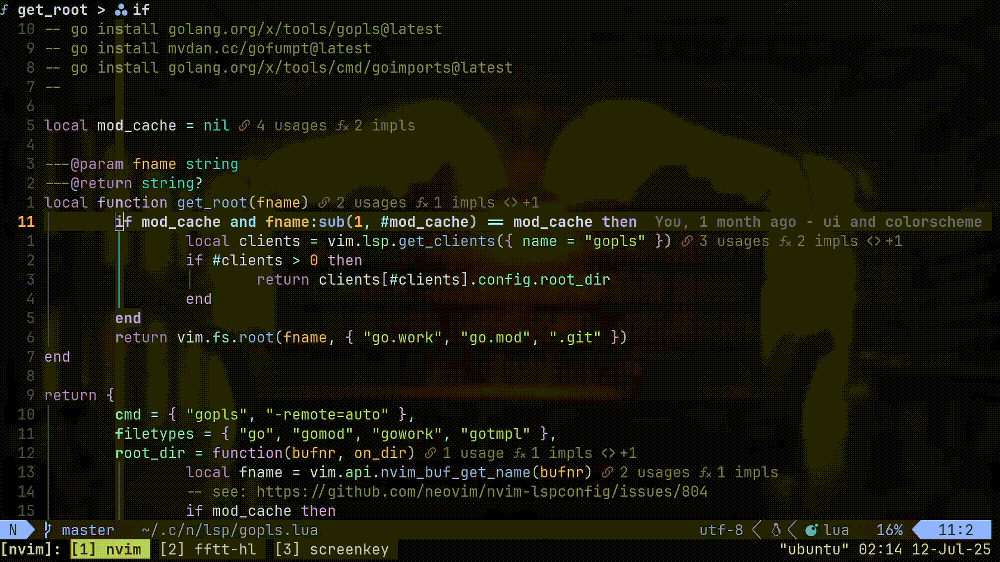
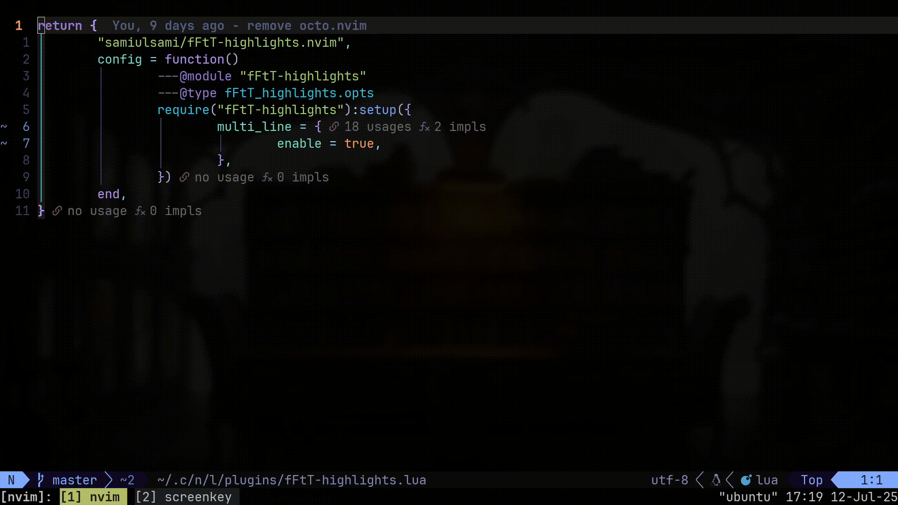
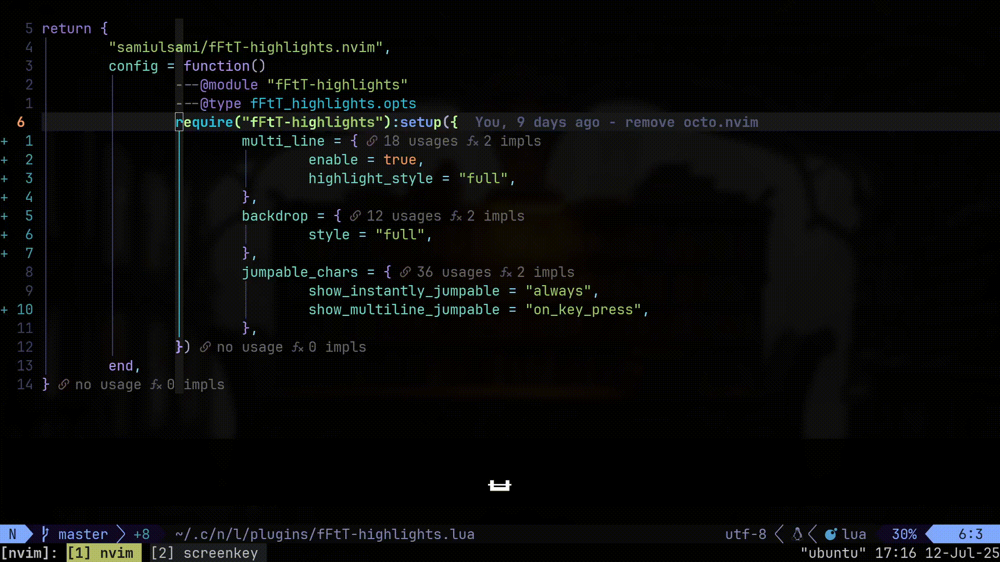

# fFtT-highlights.nvim

A highly configurable and opinionated highlighter for `f/F/t/T` motions, that borrows and improves upon features from [similar plugins](#-acknowledgements).
Extremely minimalistic by default, but can be effortlessly configured to support any and all of the features mentioned below.

---

### ✨ Features
- <b>Smart motions</b>: Use `f/F/t/T` to jump to the next/previous occurence of the current character.
- <b>Unique character indicators</b>: Highlight characters that require 1-2 jumps to get to.
- <b>Numbered matches</b>: Show the number of jumps required to get to each matching character
- <b>Macro & dot-repeat support.</b>
- <b>Multi-line support.</b>
- <b>Smart-case/No-case matching.</b>

⚠️ <u><i>Most of the above are disabled by default, and must be enabled manually</i></u>

---

### 📸 Showcase
<details>
  <summary><b>Default config</b></summary>

  ```lua
  {}
  ```
</details>

<p align="center">
  
</p>

---
<details>
  <summary><b>Multiline enabled</b></summary>

  ```lua
  {
	  multi_line = {
		  enable = true,
	  }
  }
  ```
</details>
<p align="center">
  
</p>

---
<details>
  <summary><b>Jumpable chars highlighting:</b></summary>

  ```lua
  {
	  multi_line = {
		  enable = true,
	  },
	  match_highlight = {
		  style = "full",
	  },
	  backdrop = {
		  style = {
			  on_key_press = "full",
			  show_in_motion = "full",
		  },
	  },
	  jumpable_chars = {
		  show_instantly_jumpable = "always",
		  show_multiline_jumpable = "on_key_press",
	  }
  }
  ``````
</details>

<p align="center">
  
</p>

---
<details>
<summary><b>Jump numbers next to each match:</b></summary>

  ```lua
  {
	  multi_line = {
		  enable = true,
	  },
	  match_highlight = {
		  style = "full",
		  show_jump_numbers = true,
	  },
	  backdrop = {
		  style = {
			  on_key_press = "full",
			  show_in_motion = "full",
		  },
	  },
  }
  ```
</details>

<p align="center">
  
</p>

---
### 🔍 Why make another highlighter?
<b>Because I wanted:</b>
- Macro/dot-repeat support.
- A minimalistic highlighter that highlights no more than is necessary.
- A feature-rich highlighter that lights up my entire buffer upon a keypress.
- A near-native vi-like experience, then switching to a bloaty mess the next day, then switching back again.
- Multiline searching/highlighting, but I didn't want to highlight the entire buffer with irrelevant matches.
- A multiline version of `eyeliner.nvim` / `quick-scope.`
- To localize the search to my current window, or a configurable range of lines.
- It fun 👍.

---
### ⚙️ Requirements
- Tested on Neovim >= 0.11.0
---
### 🧰 Setup
#### Lazy.nvim
```lua
{
	"samiulsami/fFtT-highlights.nvim",
	config = function()
		---@module "fFtT-highlights"
		---@type fFtT_highlights.opts
		require("fFtT-highlights"):setup({
			---See below for default configuration options
		})
	end,
}
```
#### 🛠️ Default options
```lua
---@type fFtT_highlights.opts
local default_opts = {
	f = "f", -- forward search key
	F = "F", -- backward search key
	t = "t", -- forward till key
	T = "T", -- backward till key
	next = ";", -- next key
	prev = ",", -- previous key
	reset_key = "<Esc>", -- key to reset highlights and cancel character-pending state

	on_reset = nil, -- callback to run when reset_key is pressed

	smart_motions = false, -- whether to use f/F/t/T to go to next/previous characters

	-- options: "default" | "smart_case" | "ignore_case"
	case_sensitivity = "default", -- case sensitivity

	max_highlighted_lines_around_cursor = 300, -- max number of lines to consider above/below cursor for highlighting. Doesn't prevent jumps outside the range.

	match_highlight = {
		enable = true, -- enable/disable matching chars highlight.

		-- options: "full" | "minimal" | "none"
		-- "full": highlights all matches until the top/bottom border or multi_line.max_lines.
		-- "minimal": highlights the prefix/suffix matches in the current line, and upto exactly ONE match above/below the cursor if it exists.
		-- "none": disables highlighting for matching characters.
		style = "minimal", -- match highlighting style.
		highlight_radius = 500, -- consider at most this many characters for highlighting around the cursor.
		show_jump_numbers = false, -- show the number of jumps required to get to each matching character.
		priority = 900, -- match highlight priority.
	},

	multi_line = {
		enable = false, -- enable/disable multi-line search
		max_lines = 300, -- max lines to consider for jumping/highlights above/below cursor if multi-line search is enabled.
	},

	backdrop = {
		style = {
			-- options: "full" | "minimal" | "none"
			-- "full": highlights from the cursor line upto the top/bottom border.
			-- "current_line": highlights from the until the last matching character in the cursor line.
			-- "none": disables backdrop highlighting on keypress.
			on_key_press = "full", -- highlight backdrop on keypress.

			-- options: "full" | "upto_next_line" | "current_line" | "none"
			-- "full": highlights from the cursor line upto the top/bottom border.
			-- "current_line": highlights from the until the last matching character in the cursor line.
			-- "upto_next_line": highlights from the cursor line upto the next matching character in another line.
			-- "none": disables backdrop highlighting while in motion.
			show_in_motion = "upto_next_line", -- highlight backdrop while in motion.
		},
		border_extend = 1, -- extend backdrop border horizontally by this many characters.
		priority = 800, -- backdrop highlight priority.
	},

	jumpable_chars = {
		-- options: "always" | "on_key_press" | "never"
		show_instantly_jumpable = "never", -- when to highlight characters that can be jumped to in 1 step (options below have no effect when this is disabled).
		show_secondary_jumpable = "never", -- when to highlight characters that can be jumped to in 2 steps.
		show_all_jumpable_in_words = "never", -- when to highlight all characters that can be jumped to in 1 or 2 steps. Highlights one char per word by default.
		show_multiline_jumpable = "never", -- when to highlight jumpable characters in other lines.
		min_gap = 1, -- minimum gap between two jumpable characters.
		priority = 1100, -- jumpable chars highlight priority.
		priority_secondary = 1000, -- secondary jumpable chars highlight priority.
	},

	disabled_filetypes = {}, -- disable the plugin for these filetypes (falls back to default keybindings)

	disabled_buftypes = { "nofile" }, -- disable the plugin for these buftypes (falls back to default keybindings)
}
```
---
### 🖌️ Highlight groups
| Name                   | Description                                              |
| --------------------------------- | -------------------------------------------------------- |
| `fFtTBackDropHighlight`           | Used for backdrop shading                                |
| `fFtTMatchHighlight`              | Highlight for matched characters                         |
| `fFtTJumpNumHighlight`            | Highlight for jump numbers (multi-digit)                 |
| `fFtTJumpNumHighlightSingleDigit` | Highlight for jump numbers (single-digit only)           |
| `fFtTUniqueHighlight`             | Highlight for unique jumpable characters                 |
| `fFtTUniqueHighlightSecondary`    | Highlight for secondary unique characters (2-step jumps) |
---
### 💎 Acknowledgements
Thanks to the following plugins for their inspiration, and especially to `mini.jump` for solving macro compatibility and multi-line search in an elegant way.
- [mini-jump](https://github.com/echasnovski/mini.nvim/blob/main/readmes/mini-jump.md) 
- [flash-nvim](https://github.com/folke/flash.nvim)
- [clever-f](https://github.com/rhysd/clever-f.vim)
- [jinh0/eyeliner.nvim](https://github.com/jinh0/eyeliner.nvim)
- [quick-scope](https://github.com/unblevable/quick-scope)
- [nvim-fFHighlight](https://github.com/kevinhwang91/nvim-fFHighlight)
---
#### 📋 TODO
- [ ] Optimize highlighting performance and fault tolerance.
- [ ] Fix redundancies.
- [ ] Tests and/or ci.
- [ ] Continue resisting the urge to add more useless features.
